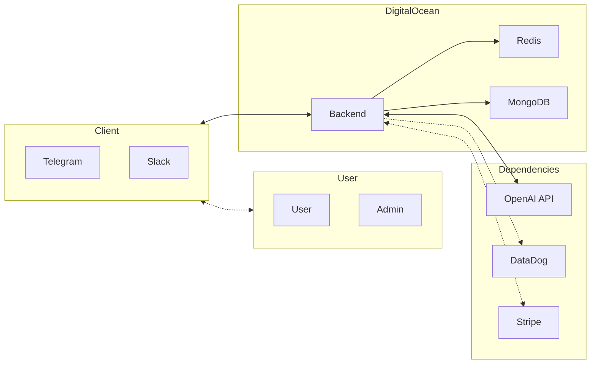

# talk2robots
Complete and extensible human to AI interface

## What is talk2robots?

talk2robots is a complete and extensible human to AI interface. It is a framework that allows you to easily create your own chatbot, voice assistant, or any other kind of AI interface. It is designed to be easy to use and to extend, and it is completely free and open source.

### Try it 

in Telegram: https://t.me/gienjibot

in Slack:

<a href="https://slack.com/oauth/v2/authorize?client_id=6115693016032.6116447482768&scope=app_mentions:read,channels:history,channels:join,channels:read,chat:write,groups:history,groups:write,im:history,im:read,im:write,mpim:history,mpim:read,mpim:write,users:read,commands,reactions:read&user_scope="></a>

## 📝 Table of contents

- [Development in GitHub Codespaces](#-development-in-github-codespaces)
  - [Requirements](#requirements)
  - [Start local development environment](#start-local-development-environment)
- [Deploy and enjoy](#-deploy-and-enjoy)
  - [DigitalOcean Requirements](#digitalocean-requirements)
  - [Stripe Requirements](#stripe-requirements)
- [Architecture overview](#%EF%B8%8F-architecture-overview)
- [Features](#features)

## ⛏️ Development in GitHub Codespaces

### Requirements
- Setup Telegram bot - https://core.telegram.org/bots#6-botfather and save in the repo/Codespace secrets as `TELEGRAM_BOT_TOKEN`
- Setup OpenAI API key - https://platform.openai.com/account/api-keys and save in the repo/Codespace secrets as `OPENAI_API_KEY`

### Start local development environment

- Fork the repository
- Start [a Codespace](https://docs.github.com/codespaces)
- Make port 80 of the Codespace public, [guide](https://docs.github.com/en/codespaces/developing-in-codespaces/forwarding-ports-in-your-codespace).
- Run the following command inside the Codespace:
  ```bash
  $ make start
  ```

- Try accessing backend
  ```bash
  $ curl http://localhost/health
  ```

## 🚀 Deploy and enjoy
### DigitalOcean Requirements 

- Setup DO CLI - https://docs.digitalocean.com/reference/doctl/how-to/install/
- Setup DigitalOcean PAT - https://docs.digitalocean.com/reference/api/create-personal-access-token/ and save in the repo secrets as `DO_PAT`

### Stripe Requirements

- Setup Stripe CLI - https://stripe.com/docs/stripe-cli#install

## 🏗️ Architecture overview



## Features
- [x] Telegram bot
- [x] Slack integration
- [ ] Discord bot
- [x] Telegram voice chat (OpenAI Wisper)
- [x] Cache persistent layer (Redis)
- [x] System health check and analytics (DataDog)
- [x] Business analytics integration (DataDog)
- [x] Alarm system/notifications integration (Telegram System Bot, DataDog)
- [x] Support/feedback system (likes/dislikes, comments, etc.)
- [x] Payment system integration (Stripe)
- [ ] Image recognition and generation
- [ ] Video/Audio summary
- [ ] Text2Speech (Google Voice)
- [ ] Context awareness and memory (Langchain)

## Admin Features (via Telegram System bot)

- [x] Get system status `/status`
- [x] Ban/Unban user `/banuser` `/unbanuser`
- [x] Reset Stripe subscription for a user `/stripereset`
- [x] Reset usage for a user `/usagereset`
- [x] Get user info `/user`
- [x] Get users count `/userscount`
- [x] Get users count for a subscription `/usersforsubscription`
