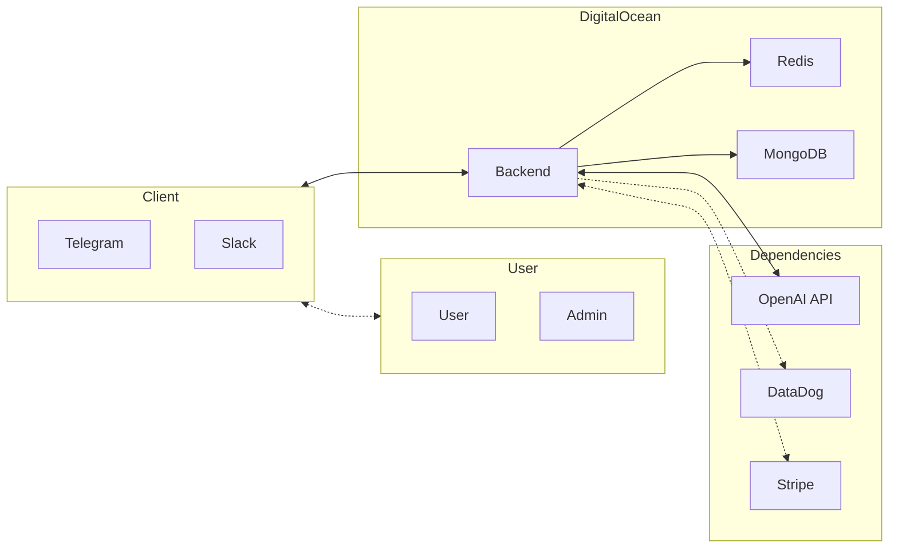

# talk2robots
Complete and extensible human to AI interface

## What is talk2robots?

talk2robots is an extensible human to AI interface. It is a framework that allows you to easily create your own chatbot, voice assistant, or any other kind of AI interface. It is designed to be easy to use and to extend.

### Try it 

in Telegram: https://t.me/gienjibot

in Slack:

<a href="https://slack.com/oauth/v2/authorize?client_id=6115693016032.6116447482768&scope=app_mentions:read,channels:history,channels:join,channels:read,chat:write,groups:history,groups:write,im:history,im:read,im:write,mpim:history,mpim:read,mpim:write,users:read,commands,reactions:read&user_scope="></a>

## 📝 Table of contents

- [General Features](#general-features)
- [Telegram Features](#telegram-features)
- [Slack Features](#slack-features)
- [Admin Features (via Telegram System bot)](#admin-features-via-telegram-system-bot)
- [Development in GitHub Codespaces](#-development-in-github-codespaces)
  - [Requirements](#requirements)
  - [Start local development environment](#start-local-development-environment)
- [Deploy and enjoy](#-deploy-and-enjoy)
  - [DigitalOcean Requirements](#digitalocean-requirements)
  - [Stripe Requirements](#stripe-requirements)
- [Architecture overview](#%EF%B8%8F-architecture-overview)

## General Features
- [x] Telegram bot
- [x] Slack integration
- [ ] Discord bot
- [x] Voice/Audio/Video prompt (OpenAI Wisper)
- [x] Cache persistent layer (Redis)
- [x] System health check and analytics (DataDog)
- [x] Business analytics integration (DataDog)
- [x] Alarm system/notifications integration (Telegram System Bot, DataDog)
- [x] Support/feedback system (likes/dislikes)
- [x] Payment system integration (Stripe)
- [x] Video/Audio transcription
- [x] Video/Audio summary
- [x] Voice response (OpenAI TTS)
- [x] Threads, i.e. context awareness and memory (OpenAI Assistant Threads)
- [ ] Image recognition (OpenAI Multimodal gpt-4-vision-preview)
- [ ] Image generation (DALL-E)


## Telegram Features

- [x] Chat with GPT-3.5 or GPT-4 `/chatgpt`. The bot remembers the context of the conversation until you say `/clear`.
- [x] Voice support, just send a voice message in any popular language
- [x] `/voicegpt` for full voice experience, i.e. voice prompt and voice reply (with OpenAI TTS)
- [x] `/grammar` mode just to correct grammar
- [x] `/teacher` mode to correct and explain grammar
- [x] `/transcribe` voice/audio/video messages
- [x] `/summarize` text/voice/audio/video messages
- [x] Upgrade subscription `/upgrade`. Three subscription plans are available:
  - Free - limits to $0.05/month of OpenAI API usage (text and audio)
  - Free+ - limits to $0.25/month OpenAI API usage (just to test the system and conversion rates)
  - Basic - $9.99/month, limits to $9.99/month OpenAI API usage
- [x] Cancel subscription `/downgrade`
- [x] Get user status (usage, limits etc) `/status`
- [x] Get `/support`
- [x] View terms `/terms`
- [x] pin language for transcription and voice recognition by adding 'language' parameter to a command, e.g. `/transcribe hebrew`. Useful when translation of transcripts is needed or when studying a foreign language.

While in groups context:
- the bot will only reply when mentioned (so commands should be suffixed with @gienjibot, e.g. `/upgrade@gienjibot`)
- in /transcribe and /grammar modes, the bot will react to all messages to either transcribe audio or correct grammar.

### Telegram bot in action

https://github.com/radiantspace/talk2robots/assets/8243681/3cfd47c4-55ed-4eb3-9f9a-e3c1c3605a3b

## Slack Features

- [x] Chat in DM, private and public channels and/or threads
- [x] Chat with GPT-3.5 `/chatgpt`. The bot remembers the context of the conversation until you say `/clear`.
- [x] Use `/grammar` mode just to correct grammar, you can also add :eyeglasses: emoji to a message to get grammar correction reply
- [x] Summarize message thread by adding :memo: emoji to a message
- [ ] Use `/teacher` mode to correct and explain grammar
- [x] Upgrade subscription `/upgrade`, only free subscription is available at the moment:
  - Free - limits to $0.05 OpenAI API usage
  - Free+ - limits to $0.25 OpenAI API usage (just to test the system and conversion rates)
- [ ] Cancel subscription `/downgrade`
- [ ] Get user status (usage, limits etc) `/mystatus`
- [ ] Get `/support`
- [ ] View terms `/terms`

### Slack bot in action

https://github.com/radiantspace/talk2robots/assets/8243681/c5805c11-716b-47ab-9f5e-a7814069cdfd


## Admin Features (via Telegram System bot)

- [x] Get system status `/status`
- [x] Ban/Unban user `/banuser` `/unbanuser`
- [x] Reset Stripe subscription for a user `/stripereset`
- [x] Reset usage for a user `/usagereset`
- [x] Get user info `/user`
- [x] Get users count `/userscount`
- [x] Get users count for a subscription `/usersforsubscription`


## 🏗️ Architecture overview



## ⛏️ Development in GitHub Codespaces

### Requirements
- Setup Telegram bot - https://core.telegram.org/bots#6-botfather and save in the repo/Codespace secrets as `TELEGRAM_BOT_TOKEN`
- Setup OpenAI API key - https://platform.openai.com/account/api-keys and save in the repo/Codespace secrets as `OPENAI_API_KEY`

### Start local development environment

- Fork the repository
- Start [a Codespace](https://docs.github.com/codespaces)
- Make port 80 of the Codespace public, [guide](https://docs.github.com/en/codespaces/developing-in-codespaces/forwarding-ports-in-your-codespace).
- Run the following command inside the Codespace:
  ```bash
  $ make start
  ```

- Try accessing backend
  ```bash
  $ curl http://localhost/health
  ```

## 🚀 Deploy and enjoy
### DigitalOcean Requirements 

- Setup DO CLI - https://docs.digitalocean.com/reference/doctl/how-to/install/
- Setup DigitalOcean PAT - https://docs.digitalocean.com/reference/api/create-personal-access-token/ and save in the repo secrets as `DO_PAT`

### Stripe Requirements

- Setup Stripe CLI - https://stripe.com/docs/stripe-cli#install

